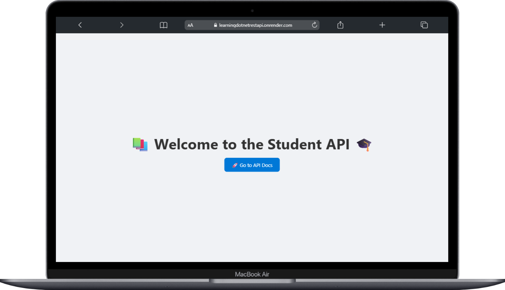

# Learning .NET REST API

A comprehensive learning repository demonstrating how to build and deploy a simple REST API using .NET Core. This project serves as a practical guide for developers getting started with .NET web API development.

## 🚀 Live Demo

**Live API:** [https://learningdotnetrestapi.onrender.com/](https://learningdotnetrestapi.onrender.com/)

## 📖 Overview

This repository contains a simple yet complete REST API built with .NET Core, showcasing best practices for API development, documentation, and deployment. Perfect for beginners learning .NET web development or as a reference for building production-ready APIs.


## 📱 Screenshots

### Home Page


### API Documentation (Swagger UI)


### Interactive API Explorer


## 🚀 Getting Started

### Prerequisites

- [.NET 6.0 SDK](https://dotnet.microsoft.com/download/dotnet/6.0) or later
- [Visual Studio](https://visualstudio.microsoft.com/) or [Visual Studio Code](https://code.visualstudio.com/)
- [Git](https://git-scm.com/)

### Installation

1. **Clone the repository**
   ```bash
   git clone https://github.com/kashyapprajapat/learning-dotnet-rest-api.git
   cd learning-dotnet-rest-api
   ```

2. **Restore dependencies**
   ```bash
   dotnet restore
   ```

3. **Build the project**
   ```bash
   dotnet build
   ```

4. **Run the application**
   ```bash
   dotnet run
   ```

5. **Access the API**
   - API Base URL: `https://localhost:5001` or `http://localhost:5000`
   - Swagger UI: `https://localhost:5001/swagger`


Once the application is running, you can access the interactive API documentation at:
- **Local:** `https://localhost:5001/swagger`
- **Live:** [https://learningdotnetrestapi.onrender.com/swagger](https://learningdotnetrestapi.onrender.com/swagger)

## 🏗️ Project Structure

```
learning-dotnet-rest-api/
├── Controllers/          # API controllers
├── Models/              # Data models
├── Services/            # Business logic services
├── DemoImages/          # Screenshot images
├── Properties/          # Application properties
├── appsettings.json     # Configuration settings
├── Program.cs           # Application entry point
├── Startup.cs           # Application startup configuration
└── README.md           # Project documentation
```


---

**Happy Coding! 🚀 ☕👨🏻‍💻🧋**